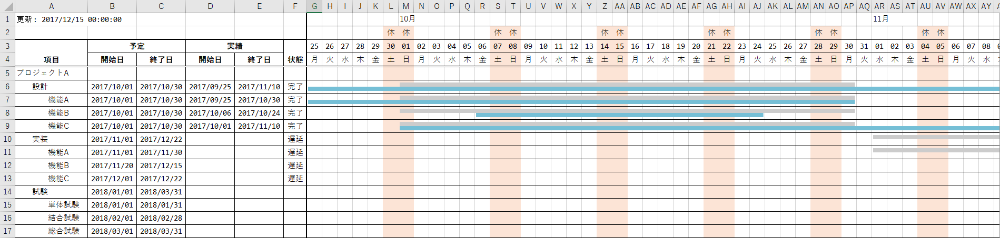

# PainlessGantt

[](https://hub.docker.com/r/manabedaiki/painless-gantt)

YAML フォーマットでガントチャートを作成しましょう。

[ihgs/yaml2gantt](https://github.com/ihgs/yaml2gantt) にインスパイア❤️されました。



## 使い方

Docker 上で動かすことを前提としています。

```sh
make build run
```

👉 [`assets`](assets) ディレクトリに `ganttchart.xlsx` が作成されます。

## 使い方 (実践)

[`assets`](assets) ディレクトリの内容を参考に、あなたのプロジェクト固有の設定を作成してください。

- `project.yml`
- `template.xlsx` (そのままでも問題ありません)

Docker 上で実行します。

```sh
docker container run \
    --rm \
    -v /あなたのプロジェクト固有の設定:/data \
    manabedaiki/painless-gantt:latest \
        --project /data/project.yml \
        --template /data/template.xlsx \
        --output /data/ganttchart.xlsx
```

👉 `/あなたのプロジェクト固有の設定/ganttchart.xlsx` が作成されました！🎉👏

## ガントチャートの定義

ガントチャートの定義は YAML フォーマットで記述します。
日本の現場指向😨なので、設定ファイルは日本語です。

サンプルが [`assets/project.yml`](assets/project.yml) にあります。

```yaml
設定:
  祝日:
  - 2017/12/25
  - 2017/12/26
  - 2017/12/27
  - 2017/12/28
  - 2017/12/29
  - 2018/01/01
  - 2018/01/02
  - 2018/01/03
  - 2018/01/04
  - 2018/01/05
  予定線の色: { 赤: 0xCC, 緑: 0xCC, 青: 0xCC }
  実績線の色: { 赤: 0x75, 緑: 0xBF, 青: 0xD6 }

プロジェクト一覧:
- プロジェクト: プロジェクトA
  作業一覧:
  - 作業: 設計
    詳細:
    - 作業: 機能A
      予定: { 開始: 2017/10/01, 終了: 2017/10/30 }
      実績: { 開始: 2017/09/25, 終了: 2017/10/30 }
    - 作業: 機能B
      予定: { 開始: 2017/10/01, 終了: 2017/10/30 }
      実績: { 開始: 2017/10/06, 終了: 2017/10/24 }
    - 作業: 機能C
      予定: { 開始: 2017/10/01, 終了: 2017/10/30 }
      実績: { 開始: 2017/10/01, 終了: 2017/11/10 }
  - 作業: 実装
    詳細:
    - 作業: 機能A
      予定: { 開始: 2017/11/01, 終了: 2017/11/30 }
    - 作業: 機能B
      予定: { 開始: 2017/11/20, 終了: 2017/12/15 }
    - 作業: 機能C
      予定: { 開始: 2017/12/01, 終了: 2017/12/22 }
  - 作業: 試験
    詳細:
    - 作業: 単体試験
      予定: { 開始: 2018/01/01, 終了: 2018/01/31 }
    - 作業: 結合試験
      予定: { 開始: 2018/02/01, 終了: 2018/02/28 }
    - 作業: 総合試験
      予定: { 開始: 2018/03/01, 終了: 2018/03/31 }
```

## テンプレート

`--template` コマンドライン引数で指定した Excel ファイルをベースにガントチャートを作成しています。
いくつかのルールを守ることで、ガントチャートの見た目をカスタマイズできます。

### シート名

`ガントチャート` という名前のシートが必要です。

### セル構造

`ガントチャート` シートの特定のセルのスタイルをコピーする作りになっています。

`*` 部分にスタイルを設定してください。

|   | A   | B   | C   | D   | E   | F   | G   | H   | I   |
|---|-----|-----|-----|-----|-----|-----|-----|-----|-----|
| 1 | `*` |     |     |     |     |     | `*` |     |     |
| 2 |     |     |     |     |     |     | `*` | `*` | `*` |
| 3 |     |     |     |     |     |     | `*` | `*` | `*` |
| 4 |     |     |     |     |     |     | `*` | `*` | `*` |
| 5 | `*` | `*` | `*` | `*` | `*` | `*` | `*` | `*` | `*` |

#### メタデータ

ガントチャートを作成した時刻 (`DateTime`) が設定されます。

|   | A   | B | C | D | E | F | G | H | I |
|---|-----|---|---|---|---|---|---|---|---|
| 1 | `*` |   |   |   |   |   |   |   |   |
| 2 |     |   |   |   |   |   |   |   |   |
| 3 |     |   |   |   |   |   |   |   |   |
| 4 |     |   |   |   |   |   |   |   |   |
| 5 |     |   |   |   |   |   |   |   |   |

#### 月

カレンダーの日付 (`DateTime`) が設定されます。

|   | A | B | C | D | E | F | G   | H | I |
|---|---|---|---|---|---|---|-----|---|---|
| 1 |   |   |   |   |   |   | `*` |   |   |
| 2 |   |   |   |   |   |   |     |   |   |
| 3 |   |   |   |   |   |   |     |   |   |
| 4 |   |   |   |   |   |   |     |   |   |
| 5 |   |   |   |   |   |   |     |   |   |

#### 平日/休日/祝日

その日が平日/休日/祝日かを表す 1 文字が設定されます。

平日の場合は G 列、休日の場合は `H` 列、祝日の場合は `I` 列のスタイルを使用します。

|   | A | B | C | D | E | F | G   | H   | I   |
|---|---|---|---|---|---|---|-----|-----|-----|
| 1 |   |   |   |   |   |   |     |     |     |
| 2 |   |   |   |   |   |   | `*` | `*` | `*` |
| 3 |   |   |   |   |   |   |     |     |     |
| 4 |   |   |   |   |   |   |     |     |     |
| 5 |   |   |   |   |   |   |     |     |     |

#### 日

カレンダーの日付 (`DateTime`) が設定されます。
日付 (`dd`) の表示を想定しています。

平日の場合は G 列、休日の場合は `H` 列、祝日の場合は `I` 列のスタイルを使用します。

|   | A | B | C | D | E | F | G   | H   | I   |
|---|---|---|---|---|---|---|-----|-----|-----|
| 1 |   |   |   |   |   |   |     |     |     |
| 2 |   |   |   |   |   |   |     |     |     |
| 3 |   |   |   |   |   |   | `*` | `*` | `*` |
| 4 |   |   |   |   |   |   |     |     |     |
| 5 |   |   |   |   |   |   |     |     |     |

#### 曜日

カレンダーの日付 (`DateTime`) が設定されます。
曜日 (`aaa`) の表示を想定しています。

平日の場合は G 列、休日の場合は `H` 列、祝日の場合は `I` 列のスタイルを使用します。

|   | A | B | C | D | E | F | G   | H   | I   |
|---|---|---|---|---|---|---|-----|-----|-----|
| 1 |   |   |   |   |   |   |     |     |     |
| 2 |   |   |   |   |   |   |     |     |     |
| 3 |   |   |   |   |   |   |     |     |     |
| 4 |   |   |   |   |   |   | `*` | `*` | `*` |
| 5 |   |   |   |   |   |   |     |     |     |

#### ガントチャート

ガントチャートの背景として使用します。

平日の場合は G 列、休日の場合は `H` 列、祝日の場合は `I` 列のスタイルを使用します。

|   | A | B | C | D | E | F | G   | H   | I   |
|---|---|---|---|---|---|---|-----|-----|-----|
| 1 |   |   |   |   |   |   |     |     |     |
| 2 |   |   |   |   |   |   |     |     |     |
| 3 |   |   |   |   |   |   |     |     |     |
| 4 |   |   |   |   |   |   |     |     |     |
| 5 |   |   |   |   |   |   | `*` | `*` | `*` |

#### チケット

作業内容が設定されます。

- A 列: タイトル
- B 列: 予定開始日
- C 列: 予定終了日
- D 列: 実績開始日
- E 列: 実績終了日
- F 列: 状態

|   | A   | B   | C   | D   | E   | F   | G   | H   | I   |
|---|-----|-----|-----|-----|-----|-----|-----|-----|-----|
| 1 |     |     |     |     |     |     |     |     |     |
| 2 |     |     |     |     |     |     |     |     |     |
| 3 |     |     |     |     |     |     |     |     |     |
| 4 |     |     |     |     |     |     |     |     |     |
| 5 | `*` | `*` | `*` | `*` | `*` | `*` | `*` | `*` | `*` |
